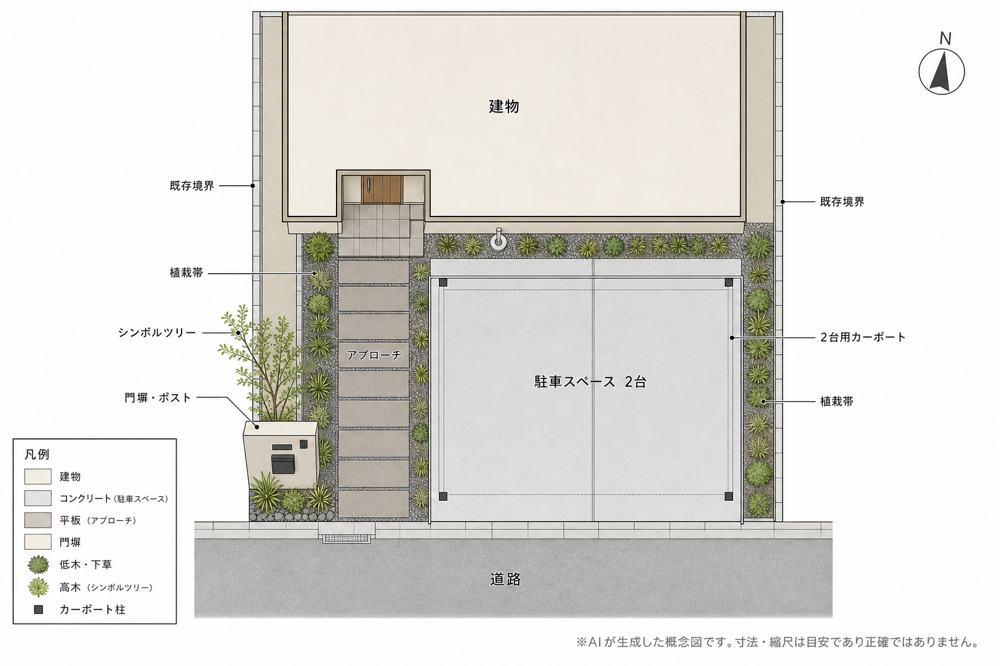

# garden-renovation-skills

> **Codex Agent Skills** — 現況写真と自然言語の要望から、庭・外構のリフォーム提案をAIで生成するスキル集。

造園・外構業者向けの Codex スキルを 3 本セットで提供します。現況写真をベースに完成予想図・平面図を生成し、施主に渡せる提案ページ（HTML）まで一気通貫で作れます。

---

## デモ

**← BEFORE / AFTER →**


| 現況写真 | 完成予想図 |
|---|---|
| 土の駐車スペース・殺風景な外構 | 2台用カーポート＋タイル舗装のモダン外構 |

**平面図（AI生成）**



**→ [提案ページのサンプルを見る](https://harunamitrader.github.io/harunami_AI_base/showcase/garden-carport-proposal/)**

---

## スキル構成

```
garden-renovation-skills/
├── garden-renovation-visualizer/   # ① 完成予想図の生成（メイン）
│   └── SKILL.md
├── garden-renovation-siteplan/     # ② 外構平面図の生成
│   └── SKILL.md
└── garden-renovation-proposal/     # ③ 施主向け提案ページ（HTML）の生成
    ├── SKILL.md
    └── assets/
        └── proposal.template.html
```

3本は独立して使えますが、①→②→③の順に連携させると一番効果的です。

---

## スキル詳細

### ① garden-renovation-visualizer（メイン）

現況写真と自然言語の要望から **改修後の完成予想図** を生成します。

**特徴**
- Codex の built-in `image_gen`（gpt-image-2）の **edit モード** を使用
- 建物・フェンス・隣地構造物など変更対象外の部分は写真のまま保持
- 変更したい部分だけをプロンプトで指定して置き換え
- 生成後に建物形状・窓の数・パースの保持を検証し、崩れがあれば修正イテレーション
- 改修内容・敷地の位置関係を `plan.md` に記録（②③の入力として使える）

**使い方（Codex）**
```
この庭の写真から完成予想図を作って。
要望：芝生を撤去してウッドデッキと砂利敷きにしたい。
```
または `$garden-renovation-visualizer` でスキルを明示的に呼び出す。

**出力**
```
garden-design-output/{YYYY-MM-DD}-{slug}/
├── before.png   # 元写真のコピー
├── after.png    # 完成予想図
└── plan.md      # 改修プランの記録
```

**能力の限界**
- 編集は再生成ベースのため、建物の形状・構図レベルでは高精度に保持されますが、壁のテクスチャや葉の細部はピクセル単位では一致しません
- 出力解像度の実用上限は約 2K（元写真がそれ以上でも超えられない）
- 一度に変更する項目が 4 つを超えると保持精度が下がるため、スキル内で 2 段階に分割します

---

### ② garden-renovation-siteplan

`plan.md` と完成予想図をもとに **外構平面図（真上視点の 2D サイトプラン）** を生成します。

**特徴**
- gpt-image-2 の高精度な日本語テキスト描画（99%超）を活かし、ラベル・凡例・方位記号を画像内に直接描画
- 斜め写真からの位置関係を再現（寸法・縮尺は概算）
- CAD 図面の代替ではなく、施主への説明用の概念図

**使い方（Codex）**
```
このプランの平面図も作って。
```

---

### ③ garden-renovation-proposal

完成予想図・平面図・改修プランをまとめて **施主向け提案ページ（HTML）** を生成します。

**特徴**
- モダンデザイン、スマホ対応、スクロール 1 ページ完結
- **BEFORE/AFTER 比較スライダー**付き（ドラッグで写真を比較）
- 完成予想図・平面図は `img` タグで埋め込むだけなので再描画なし（AI 誤りが混入しない）
- 会社情報は `assets/company.json` に保存して使い回し可能
- 金額・工期はユーザーが提示した値のみ記載（推測で書かない）
- フォルダごと渡せばオフラインでも閲覧可能

**使い方（Codex）**
```
山田様邸の提案ページにまとめて。工期は約2週間。
```

---

## セットアップ

### 必要環境
- [Codex CLI](https://developers.openai.com/codex/cli) または Codex デスクトップアプリ
- Codex の image_gen 機能が使えるプラン（CLI / App 共通）

### インストール

**グローバルスキルとして使う場合（全プロジェクトで利用可）**

```bash
cp -r garden-renovation-visualizer ~/.agents/skills/
cp -r garden-renovation-siteplan ~/.agents/skills/
cp -r garden-renovation-proposal ~/.agents/skills/
```

**プロジェクトローカルスキルとして使う場合（チームで共有する場合）**

```bash
cp -r garden-renovation-visualizer your-project/.agents/skills/
cp -r garden-renovation-siteplan your-project/.agents/skills/
cp -r garden-renovation-proposal your-project/.agents/skills/
```

### 会社情報の登録（任意）

`garden-renovation-proposal/assets/company.json` を作成しておくと、提案ページに自動で会社名・担当者名が入ります。

```json
{
  "name": "○○造園",
  "person": "担当者名",
  "tel": "000-0000-0000",
  "email": "",
  "note": ""
}
```

---

## CLI / デスクトップアプリの対応

| | Codex CLI | Codex デスクトップアプリ |
|---|---|---|
| スキルの読み込み | ✅ `~/.agents/skills/` | ✅ 同じ場所を参照 |
| built-in image_gen | ✅ | ✅ |
| 参照画像付き編集 | ✅ | ✅（スレッドに写真を添付） |
| ローカルファイル出力 | ✅ | ✅（同じ PC 上で実行） |
| Codex cloud（リモート実行） | ⚠️ ローカルファイルシステム不可 | — |

---

## ライセンス

MIT License

---

## 関連

- [AI-exterior-planner](https://github.com/harunamitrader/AI-exterior-planner) — 外構・造園の初回提案支援ツール
- [提案ページのサンプル](https://harunamitrader.github.io/harunami_AI_base/showcase/garden-carport-proposal/)
